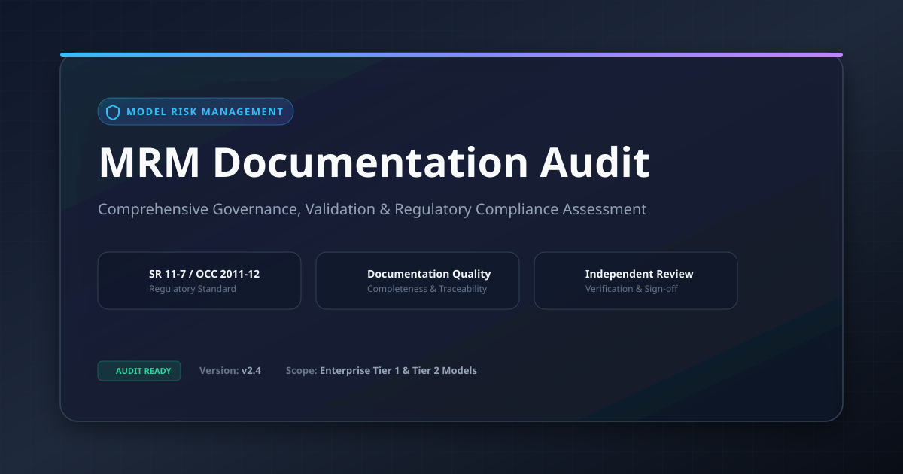

# MRM Documentation Audit

The package is designed to audit the compliance of the development/validation documentation with prescribed standard templates (development or validation). 
Acceptable file format is MS Word file. It generates a formatted, corporate-branded PDF document summarizing the results of an automated Model Risk Management (MRM) document audit.

---

## 📋 Table of Contents
1. [Overview](#overview)
2. [Usage Example](#usage-example)
3. [Dependencies](#dependencies)
4. [Function Signature](#function-signature)
5. [Input Data Structure](#input-data-structure)
6. [Report Architecture](#report-architecture) 

---

## Overview

This function converts structured output dictionary data from an XML/WordprocessingML document audit into a ReportLab PDF document.

### Features
* **Standardized Report Header:** Dynamic generation date, audit ID, and file references.
* **Executive Summary:** High-level audit status (`COMPLIANT` vs `ATTENTION REQUIRED`).
* **Internal Integrity (TOC Sync):** Tabulated comparison of Table of Contents vs. actual body headings.
* **Template Compliance & Structure:** Categorized analysis for missing mandatory sections, incorrect section numbering, and extra non-standard sections.
* **Audit Disclaimers:** Standard governance disclaimer included on a dedicated final page.

---

## Usage Example

```python
from mrm_template_audit.audit_mrm_doc import audit_model_document
from mrm_template_audit.generate_audit_pdf_report import generate_audit_pdf_report

# --- 1. Define your file paths ---
# (Here, we assume the template file and model document is stored under test folder)
MODEL_DOC = './test/MDD_Submission_v2 - TOC.docx'
TEMPLATE_DOC = './test/2_MDD_Template_TOC_NoManual_Section_Number.docx'

# --- 2. Execution Example ---
audit_output = audit_model_document(MODEL_DOC, TEMPLATE_DOC)

# --- 3. Generate the report ---
generate_audit_pdf_report(
    audit_results=audit_output,
    output_filename="./test/IFRS9_Audit_Report_2026.pdf"
)


```

---

## Dependencies

### Python Libraries
* `reportlab` (`SimpleDocTemplate`, `Paragraph`, `Table`, `TableStyle`, `Spacer`, `PageBreak`, `colors`, `inch`, `LETTER`)
* `datetime` (`datetime`)
* `os` (`os.path.abspath`)

---

## Function Signature 

### A) audit_model_document

```python
def audit_model_document(model_path, template_path):
    """
    Performs a comprehensive audit of a model document against a standard template.
    
    Includes bidirectional checks for missing mandatory sections (template vs model)
    and extra non-standard sections (model vs template).
	
	Args:
        model_path (str): Path of the model development/validation documenation file (MS Word file format) including file name.
        template_path (str): Path of the model development/validation template (MS Word file format) including file name.
    """
```

### B) generate_audit_pdf_report

```python
def generate_audit_pdf_report(audit_results: dict, output_filename: str) -> None

    """
    Generates a professional, visually appealing PDF business report explaining audit findings.
    
    This function structures findings (internal discrepancies, template compliance gaps, 
    and successful alignments) into a branded PDF format with corporate styling.

    Args:
        audit_results (dict): The dictionary output from audit_model_document.
        output_filename (str): The desired path/filename for the generated PDF.
    """
```

## Input Data Structure
The audit_results comes from output of the function `audit_model_document` that has following schema:
You can run first the function `audit_model_document` and then `generate_audit_pdf_report` to generate the audit report as shown in the above example.

```

{
  "audited_file_name": "Model_Validation_2026.docx",
  "template_file_name": "Corporate_Model_Template_v2.docx",
  "internal_discrepancies": [
    {
      "issue": "Heading Mismatch",
      "toc_location": "Section 2.1",
      "details": "TOC label does not match document section heading."
    }
  ],
  "template_discrepancies": [
    {
      "issue": "Missing Mandatory Section",
      "section": "3. Risk Assessment",
      "details": "Section missing in target document."
    },
    {
      "issue": "Incorrect Section Numbering",
      "section": "4. Model Testing",
      "details": "Found numbered as 4.1 instead of 4.0."
    },
    {
      "issue": "Extra/Non-Standard Section",
      "section": "5. Appendix C",
      "details": "Section not part of standard template."
    }
  ],
  "template_structure": [
    { "heading_text": "Executive Summary" },
    { "heading_text": "Model Overview" },
    { "heading_text": "Risk Assessment" }
  ]
}
```

## Report Architecture

```

┌───────────────────────────────────────────────┐
│              DOCUMENT AUDIT REPORT            │
│  Model: <Name>  |  Template: <Name>           │
│  Audit ID, Date & Reference Table             │
├───────────────────────────────────────────────┤
│  1. EXECUTIVE SUMMARY                         │
│     - Overall Audit Status (Pass/Fail)        │
│     - High-level Summary Metrics              │
├───────────────────────────────────────────────┤
│  2. INTERNAL INTEGRITY (TOC SYNCHRONIZATION)  │
│     - Synchronization Pass/Fail Status        │
│     - Technical Details Discrepancy Table     │
├───────────────────────────────────────────────┤
│  3. TEMPLATE COMPLIANCE & STRUCTURE           │
│     - A. Compliant Standard Sections          │
│     - B. Structural & Compliance Gaps Table   │
├───────────────────────────────────────────────┤
│  [PAGE BREAK]                                 │
│  Audit Notes & Disclaimers                    │
└───────────────────────────────────────────────┘

```

